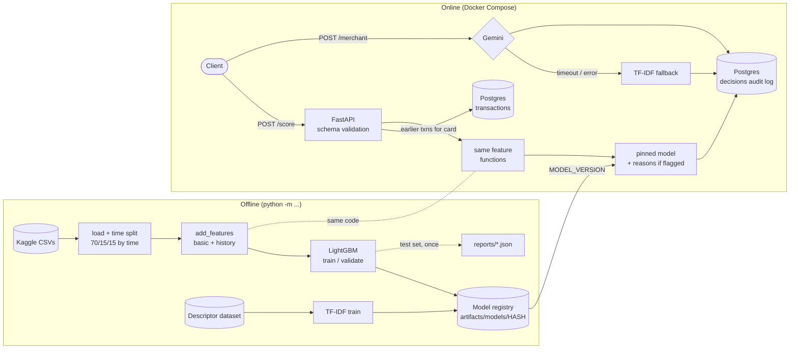

# Ledgerline

[](https://github.com/ebukae05/ledgerline/actions/workflows/ci.yml)

Scores card transactions for fraud, turns messy bank descriptors into clean merchant categories, and serves both through a tested API, with every claim backed by a measured number.

| | Result | Compared with |
|---|---|---|
| **Fraud detection** | **48% of fraud caught** at a 1% false-positive rate, on held-out future transactions | 3% for hand-written rules, 11% for logistic regression |
| **Merchant categories** | **92% accuracy on merchants never seen in training**, 86% on my own bank transactions, $0.02 per 1,000 | 60% for TF-IDF, 51% for rules |
| **Serving** | **29 ms p50**, 63 requests/s per instance, every decision audited | API scores match offline evaluation to within 1e-9 |

Built on the [IEEE-CIS Fraud Detection](https://www.kaggle.com/competitions/ieee-fraud-detection) data (590,540 real e-commerce transactions, 3.5% fraud) and [a synthetic bank-descriptor dataset](https://huggingface.co/datasets/DoDataThings/us-bank-transaction-categories-v2) checked against my own Bank of America transactions. 135 tests; CI runs lint, tests against a real Postgres, and a Docker build on every push.

**Contents:** [Architecture](#architecture) · [Fraud model](#fraud-model) · [Merchant categorization](#merchant-categorization) · [API](#api) · [How I validated this](#how-i-validated-this) · [Limitations and next steps](#limitations-and-next-steps) · [Run it](#run-it) · [Development](#development)

## Architecture



The key property: **training and serving share one feature implementation.** The API fetches a card's earlier transactions from Postgres and runs the same `basic_features` / `history_features` functions used in training, and a parity test proves the scores match.

## Fraud model

### Test set (days 152–182, evaluated once)

88,581 transactions the model never saw, all later in time than anything used for training or tuning. Evaluated a single time, after every choice was locked in ([`reports/test_results.json`](reports/test_results.json)).

| Model | PR-AUC | ROC-AUC | Recall @ 1% FPR | Precision @ top 1% |
|---|---|---|---|---|
| Random guessing | 0.035 | 0.500 | 1.0% | 3.5% |
| Rules (6 hand-written checks) | 0.096 | 0.717 | 2.6% | 17.4% |
| Logistic regression (9 features) | 0.143 | 0.749 | 11.3% | 31.3% |
| **LightGBM** (455 features, class-weighted) | **0.561** | **0.903** | **48.4%** | **89.5%** |

**At the deployed threshold** (picked on validation to flag at most 1% of legit transactions): on test it flagged 3.2% of transactions, caught **52% of fraud** and **45% of fraud dollars**, and 57% of flags were real fraud. It also wrongly flagged 1.44% of legit customers, above the 1% target: score distributions drift, so a threshold set last month won't hold exactly this month.

Test is lower than validation (PR-AUC 0.561 vs 0.652). That's expected: validation chose the configuration, tree count and threshold, so it's slightly optimistic, and test is further in the future.

**Why recall at 1% FPR leads:** it's the question a fraud team asks ("if we can bother 1 in 100 good customers, how much fraud do we stop?"). Accuracy is useless here: predicting "not fraud" every time scores 96.5%.

### How the model got there (validation, days 120–152)

Each LightGBM row is a mean over 2–3 random seeds; ± is the spread across seeds, and differences smaller than that are noise ([`reports/experiments_val.json`](reports/experiments_val.json)).

| Model | PR-AUC | Recall @ 1% FPR | Precision @ top 1% |
|---|---|---|---|
| Rules | 0.080 | 2.3% | 13.1% |
| Logistic regression | 0.172 | 12.8% | 34.9% |
| LightGBM, basic features (9) | 0.198 ± 0.003 | 15.7% | 40.6% |
| LightGBM + history features (25) | 0.238 ± 0.004 | 17.3% | 44.9% |
| LightGBM + dataset's own columns (439) | 0.641 ± 0.002 | 55.9% | 94.5% |
| LightGBM + history + dataset columns (455) | 0.643 ± 0.002 | 55.4% | 94.5% |
| …same, class-weighted (final model, 1 seed) | 0.652 | 57.3% | 94.7% |

- **History features** (per-card velocity, time since previous, amount vs card average, device/email seen before) add +0.040 PR-AUC over basic features, 10× the seed noise.
- **On top of the dataset's own columns they add nothing measurable** (+0.002, within noise). Those columns (C counts, D time gaps, V engineered features) already encode card history. History features stay because they give human-readable reasons for a flag.
- **Class weighting** (`scale_pos_weight`) added +0.009 PR-AUC and +1.9 points of recall (single run).

### Which history feature helped most (ablation)

Each group removed from the basic + history model, 3 seeds each:

| Removed | PR-AUC change |
|---|---|
| All history features | −0.040 |
| **Everything keyed on the card+address key** | **−0.022** |
| Time since previous transaction | −0.009 |
| Amount vs card average | −0.007 |
| Velocity counts (1h / 24h / 7d) | −0.007 |
| Card-level prior count | −0.006 |
| Card-level key (`card1` only) | −0.004 |
| Device/email seen before | −0.001 (noise) |

The card+address key is the most valuable single idea. LightGBM's own importance ranks `card_n_prior` first, yet removing it costs little because correlated features stand in for it. Importance shows what a model *used*; ablation shows what it *needed*.

### Data findings

From [`notebooks/01_data_exploration.ipynb`](notebooks/01_data_exploration.ipynb):

1. **3.50% of transactions are fraud**, so accuracy is not a usable metric.
2. **182 days, and fraud drifts week to week** (1.85% to 5.06%). Train is days 1–120 (413,378 rows), validation 120–152 (88,581), test 152–182 (88,581); each split has 3.4–3.5% fraud.
3. **Volume doubles around days 20–25** (peak 6,852 transactions/day vs a median of 3,050) while fraud rate hits its low.
4. **Amount alone barely separates fraud** (median $75.00 vs $68.50), except the $5–20 band: 8.3% fraud (2.4× average), holding 10% of all fraud.
5. **Missingness is a signal.** The 24% of transactions with an identity record are 3.8× more likely to be fraud. 214 of 435 columns are more than half empty.
6. **Product type matters most among simple columns:** ProductCD `C` is 11.7% fraud vs 2.0% for `W`. Mobile devices (10.2%) and credit cards (6.7% vs 2.4% debit) are elevated.
7. **Email domain varies:** outlook.com 9.5% vs gmail.com 4.4% (domains with 2,000+ transactions).
8. **Quiet hours are riskier:** ~10% fraud in the two lowest-volume hours vs ~2.3% in the busiest (clock shifted; the reference time is hidden).

## Merchant categorization

Raw descriptors like `[debit] PAYPAL *DATACAMP JYF7455M6J` → one of 17 categories. Developed on [DoDataThings/us-bank-transaction-categories-v2](https://huggingface.co/datasets/DoDataThings/us-bank-transaction-categories-v2) (68,000 synthetic rows from ~500 real merchant names, MIT).

### Test set (10,157 descriptions, all from unseen merchants, evaluated once)

| Approach | Accuracy | Macro-F1 | Cost per 1k | Latency p50 |
|---|---|---|---|---|
| Rules (regex cleanup + 17 keyword rules) | 51.2% | 0.521 | $0 | 0.01 ms |
| TF-IDF char n-grams + logistic regression | 60.0% | 0.607 | $0 | 0.45 ms |
| **Gemini 3.1 Flash-Lite**, structured JSON output | **92.3%** | **0.927** | **$0.020** | 699 ms |
| Cascade: TF-IDF when ≥95% confident, else Gemini | 92.5% | 0.928 | $0.017 | — |

### Real-world check: my own bank transactions

65 transactions from my Bank of America account (Aug–Sep 2026), imported with `python -m ledgerline.merchants.import_bofa` (which replaces person names with `[NAME]`), after leaving out 19 cash-advance-app rows that fit none of the 17 categories. Labeled by me with an AI-drafted first pass; I reviewed every row. Only aggregate numbers are published; the transactions stay in gitignored `data/private/` ([`reports/merchants_real.json`](reports/merchants_real.json)).

| Approach | Synthetic test | **My real transactions** |
|---|---|---|
| Rules | 51.2% | 53.8% |
| TF-IDF + LR | 60.0% | 61.5% |
| **Gemini 3.1 Flash-Lite** | **92.3%** | **86.2%** |
| Cascade | 92.5% | 83.1% |

### What the numbers say

- **Split by merchant, or the score is fake.** A third of rows are exact duplicates and only ~500 merchants exist. With a random split, TF-IDF scores **99.8%** by memorizing merchant names; with every test merchant unseen, it scores **60%**. Merchants are estimated from the text (first word specific to ≤2 categories): 2,142 groups, zero text overlap between train and test.
- **The LLM wins because it knows merchants.** TF-IDF's mistakes are brands it's never seen: `BRILLIANT.ORG` and `DATACAMP` → Restaurants. No character pattern says DataCamp is education; world knowledge does.
- **On real data Gemini loses ~6 points, mostly to ambiguity.** 7 of its 9 errors are judgment calls: county and city payments (Fees vs Utilities) and money received via Zelle or Apple Cash (Transfer vs Income).
- **The cascade gets worse on real data.** TF-IDF's confidence is well calibrated on synthetic data (≥90% confident: right 94% of the time) but confidently wrong on real statements, so the cascade keeps answers it should pass on. Calibration doesn't transfer across distributions. At $0.02 per 1,000, the LLM alone is the better choice here.
- **Cost** is measured from token counts on batched calls (40 per request) at the Sep 2026 list price; latency is a single-description request.
- **The real set is small:** 65 rows, ~29 distinct merchants, 8 of 17 categories. A sanity check, not a benchmark.

## API

| Endpoint | In | Out |
|---|---|---|
| `POST /score` | one transaction (IEEE-CIS fields) | fraud score, flag decision, threshold, model version, top 3 reasons when flagged |
| `POST /score/batch` | up to 1,000 transactions | results for valid records; bad records listed by index with their errors |
| `POST /merchant` | raw descriptor + debit/credit | category, confidence, and which model answered (`llm` or `tfidf`) |
| `GET /health` | | model version, database reachable (503 if not), last hour's merchant answers by method |

Interactive docs at `http://localhost:8000/docs`. `python -m ledgerline.api.demo` walks through every endpoint with real test-set transactions.

```bash
curl -s localhost:8000/merchant -H "content-type: application/json" \
  -d '{"description": "PAYPAL *DATACAMP JYF7455M6J"}'
# {"category":"Education","confidence":null,"method":"llm"}
```

A real test-set fraud, flagged with its reasons:

```json
{"transaction_id": 3559022, "score": 0.0405, "flagged": true, "threshold": 0.0268,
 "model_version": "lgbm-5697035084",
 "reasons": [
   {"feature": "D10", "contribution": 0.91, "text": "D10 = 620 (time gap, e.g. days since a previous transaction; exact meaning masked by the data provider)"},
   {"feature": "basic_log_amount", "contribution": 0.77, "text": "amount $171.00"},
   {"feature": "card1", "contribution": 0.73, "text": "card number bucket: 10925"}]}
```

### Design decisions

- **Same feature code in training and serving.** A parity test scores 300 real test-set transactions through the HTTP API (history read from Postgres) and checks every score matches the offline pipeline to within 1e-9. A synthetic-data version runs in CI.
- **Bad input never causes a 500.** The transaction schema is generated from the model's feature list. Missing fields, wrong types, non-positive amounts, unknown product codes or card types, and unknown (typo'd) fields all return a 422 naming the field. In a batch, a bad record is reported by index and the rest are scored.
- **Every decision is audited.** Each `/score` and `/merchant` call writes the input, its SHA-256 hash, output, score, threshold, flag, model version and timestamp to Postgres. If that write fails the API returns 503: no decision leaves without a record.
- **Pinned, versioned models.** The model version is a hash of its trees; `MODEL_VERSION` pins what's served and every decision logs it, like a bank's model registry with approved versions.
- **Refuses to start broken.** A missing model, unreachable database or invalid threshold stops startup with a message saying what to fix.
- **Threshold is config.** `FLAG_THRESHOLD` changes the cutoff without retraining.
- **Reasons only for flags.** Exact per-feature contributions (TreeSHAP over 2,405 trees) cost ~0.45 s, so they're computed for flagged transactions (≈3.5% of traffic), where a bank owes an explanation.
- **Fallbacks are visible.** If Gemini times out or errors, `/merchant` answers with TF-IDF and says so. `/health` reports the last hour's answers by method from the audit log, so a silent fallback shows up. (This caught a real bug: a 5 s timeout that Gemini rejects, which had quietly sent every uncached request to TF-IDF.)

### Performance

1,000 real test-set transactions per level (`python -m ledgerline.api.loadtest`), Docker Compose on an 8-CPU Windows laptop (WSL2), 4 workers, client inside the Docker network:

| Concurrent clients | Requests/s | p50 | p95 | Flagged (with reasons) p50 |
|---|---|---|---|---|
| 1 | 19.9 | **29 ms** | 93 ms | 450 ms |
| 4 | 44.8 | 54 ms | 161 ms | 794 ms |
| 8 | **62.9** | 81 ms | 233 ms | 1.09 s |
| 16 | 67.1 | 177 ms | 457 ms | 1.43 s |

Zero errors in 4,000 requests ([`reports/loadtest.json`](reports/loadtest.json)). From the Windows host, Docker Desktop's port forwarding adds ~45 ms per request ([`reports/loadtest_from_windows_host.json`](reports/loadtest_from_windows_host.json)).

p50 went from 156 ms to 29 ms after profiling: computing history features on the 8 columns they read instead of all 434, caching category lookup tables, and `POLARS_MAX_THREADS=1` in the API (Polars' thread pool cost more than it saved on per-request frames: 107 ms → 13 ms). Each change was re-checked against the parity test.

## How I validated this

- **Time-based split, no shuffling.** A test proves every validation/test transaction is strictly later than every training one.
- **No feature sees the future.** History features only use earlier transactions of the same card. Tests delete all data after a cutoff and check no earlier feature changes, and edit a later transaction and check nothing earlier moves.
- **The card+address key.** There's no customer ID. `card1` + `addr1` + first-use day (`day − D1`, since D1 counts days since the card's first transaction) stands in for one; only 3,112 of its 217,850 groups mix fraud and legit. Past fraud labels are never features.
- **Baselines first, noise measured.** Every model is compared with rules and logistic regression, and LightGBM variants are repeated across seeds so differences can be told from noise.
- **Test sets touched once.** `python -m ledgerline.evaluate` and the merchant `--test` / `--real` runs refuse to run twice without `--force` and record what they scored.
- **The oracle decides, not the model.** All scores use labels the model never saw; no LLM grades its own output.
- **Reproducible across machines.** Pinned versions, fixed seeds, deterministic LightGBM. Training from a fresh copy inside Linux Docker produced the same `lgbm-5697035084` as on Windows: bit-identical trees, threshold and metrics. (The TF-IDF model's version hashes its saved file, which differs across platforms, so only the fraud model is verified identical.)
- **Setup verified on a fresh copy.** Code from git plus the raw data, then the three commands in [Run it](#run-it): healthy API, working endpoints, 422s for bad input.

## Limitations and next steps

- **Masked features limit explanations.** The strongest signals are columns the data provider anonymized (C, D, M, V), so reasons can only name their family. With a bank's own data every feature has a real name.
- **No label delay.** Real fraud labels arrive weeks later as chargebacks; this data has them immediately. A production setup would train only on matured labels.
- **The threshold drifts** (1% FPR on validation became 1.44% on test). Next: a drift monitor comparing this week's score distribution to training, and scheduled threshold re-tuning.
- **Shadow mode** for new model versions (score alongside the live model without affecting decisions) would be the safe way to roll out a retrain.
- **Reasons are slow** (~0.45 s). A smaller model, or approximating contributions, would cut flagged-request latency.
- **The real merchant set is small** and AI-drafted (reviewed by me). A larger, independently labeled set would make the real-world number stronger.
- **Descriptors sent to Gemini** leave the machine. A bank would use a privately hosted model or a contract that rules out training on its data.

## Run it

Needs Docker, plus the [IEEE-CIS data](https://www.kaggle.com/competitions/ieee-fraud-detection/data) (`train_transaction.csv`, `train_identity.csv` in `data/raw/`; accept the competition rules first) and [`transactions-synthetic.csv`](https://huggingface.co/datasets/DoDataThings/us-bank-transaction-categories-v2) in `data/raw/merchants/`.

```bash
docker compose run --rm train   # trains the fraud and merchant models (~15 min)
docker compose run --rm seed    # loads card history into Postgres
docker compose up -d            # API on http://localhost:8000
```

Optional: copy `.env.example` to `.env` and add `GEMINI_API_KEY` to enable the LLM merchant classifier.

## Development

```bash
python -m venv .venv
source .venv/bin/activate        # Windows: .venv\Scripts\activate
pip install -e ".[dev,notebooks]"
pre-commit install
pytest                           # Postgres tests need TEST_DATABASE_URL
```

Reproduce every number:

```bash
python -m ledgerline.baselines                    # rules + logistic regression, validation
python -m ledgerline.experiments                  # model variants + ablation (~1 hour)
python -m ledgerline.train                        # final model -> artifacts/models/<version>/
python -m ledgerline.evaluate                     # fraud test set, once

python -m ledgerline.merchants.benchmark          # merchant approaches, validation
python -m ledgerline.merchants.benchmark --test   # synthetic test set, once
python -m ledgerline.merchants.benchmark --real   # your labeled transactions, once

python -m ledgerline.api.loadtest                 # latency and throughput against a running API
```

Merchant LLM answers are cached in `data/processed/llm_cache/`, so re-runs cost nothing. See [PLAN.md](PLAN.md) for the roadmap and the full dated results log.

```
src/ledgerline/
  data/        loading, time-based split
  features/    basic + leakage-safe history features, category encoder
  models/      rules, logistic regression, LightGBM, versioned registry
  eval/        metrics (PR-AUC, recall @ FPR, precision @ top-k)
  merchants/   cleanup, rules, TF-IDF, Gemini, benchmark, BofA importer
  api/         FastAPI app, schemas, scoring, Postgres store, load test, demo
```
